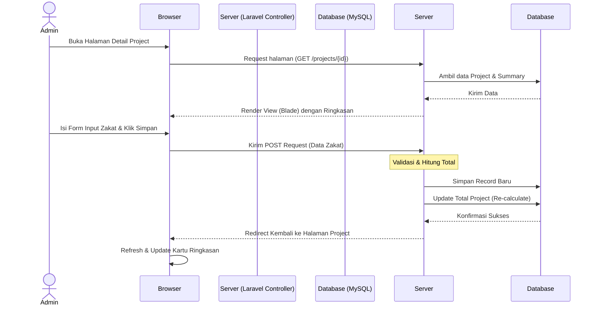

# PRD — Project Requirements Document

## 1. Overview
**Masalah:** Pencatatan dan perhitungan zakat (Fitrah dan Mal) untuk proyek komunitas atau kelompok seringkali dilakukan secara manual menggunakan kertas atau Excel. Hal ini rentan terhadap kesalahan hitung, sulit melacak data berdasarkan tahun Hijriah, dan menyulitkan pembuatan laporan akhir yang rapi.

**Solusi:** "Zakatin" adalah aplikasi berbasis web yang dirancang sebagai sistem admin pencatatan zakat terpusat. Aplikasi ini mengelompokkan data zakat berdasarkan "Project" per tahun Hijriah, menghitung total beras dan uang secara otomatis, serta memungkinkan pengunduh laporan dalam format PDF.

**Tujuan Utama:**
*   Menyediakan platform digital yang rapi untuk mengelola data zakat per penerima (per orang).
*   Otomatisasi perhitungan total zakat (kg & Rupiah) dan pembagian uang infaq.
*   Mempermudah pengurus zakat (Super Admin) dalam membuat arsip tahunan yang akurat.

## 2. Requirements
Proyek ini memiliki persyaratan fungsional dan teknis sebagai berikut:

*   **Sistem Autentikasi Terpusat:** Hanya pengguna yang terdaftar dan login yang dapat mengakses data.
*   **Manajemen Project Berbasis Tahun Hijriah:** Sistem harus dapat secara otomatis mendeteksi tahun Hijriah saat ini saat proyek baru dibuat.
*   **Fleksibilitas Input:** Form harus pintar mendeteksi metode pembayaran (Beras atau Uang) dan menampilkan field input yang relevan (Conditional Logic).
*   **Keamanan & Validasi:** Semua input wajib divalidasi server-side (khususnya Nama dan Jumlah Orang).
*   **Output Dokumen:** Sistem harus mampu mengekspor ringkasan project ke format PDF untuk keperluan arsip fisik atau digital.
*   **Tampilan Responsif:** Antarmuka harus menggunakan Bootstrap 5 agar rapi saat dibuka di HP maupun Laptop.

## 3. Core Features
Berikut adalah fitur-fitur utama yang wajib dibangun:

1.  **Auth Module (Laravel Breeze)**
    *   Login dan Register pengguna.
    *   Proteksi halaman agar hanya pengguna yang login yang bisa masuk.
2.  **Dashboard Admin**
    *   Menampilkan daftar "Project Zakat" yang sudah dibuat (contoh: Zakat 1447 H).
    *   Tampilan kartu (Card) atau tabel Bootstrap yang bersih.
    *   Aksi cepat: Lihat Detail, Hapus Project.
3.  **Generator Project Otomatis**
    *   Tombol "Tambah Project" yang otomatis menamai project dengan format "Zakat [Tahun Hijriah] H".
4.  **Detail Project & Ringkasan Statistik**
    *   Menampilkan ringkasan real-time: Total Orang, Total Beras (Kg), Total Zakat Fitrah Uang, Total Uang Wajib, Total Zakat Mal, dan Total Uang Infaq.
5.  **Form Input Data Zakat (Transaksi)**
    *   Input data per individu (Nama, Jumlah Orang yang dibayarkan).
    *   Pilihan metode: Tunai (Uang) atau Beras.
    *   Validasi cerdas: Jika pilih Beras, field uang wajib dimatikan/sembunyi (dan sebaliknya).
6.  **Laporan PDF**
    *   Fitur untuk men-download rekapitulasi seluruh data dalam satu project menjadi file PDF.

## 4. User Flow
Langkah sederhana perjalanan pengguna dalam aplikasi:

1.  **Login:** Pengguna mengakses aplikasi dan melakukan login.
2.  **Dashboard:** Sistem mengarahkan pengguna ke Dashboard.
    *   *Kondisi A:* Jika belum ada project, pengguna klik "Tambah Project Baru".
    *   *Kondisi B:* Jika sudah ada project tahun lalu, user bisa melihatnya di daftar.
3.  **Input Data:** Pengguna memilih salah satu project, lalu mengisi data orang yang berzakat melalui form input di bagian bawah.
4.  **Review:** Setelah input disimpan, ringkasan angka (Total Kg, Total Uang) di halaman tersebut otomatis bertambah.
5.  **Selesai / Export:** Pengguna menekan tombol "Download PDF" untuk menyimpan laporan project tersebut.

## 5. Architecture
Aplikasi menggunakan arsitektur **MVC (Model-View-Controller)** khas Laravel. Request dari browser (Client) akan diterima oleh Controller, diproses logikanya (termasuk perhitungan zakat), disimpan ke Database (MySQL), dan dikembalikan dalam bentuk halaman HTML (Blade) ke Browser.

### System Sequence Diagram
Diagram ini menggambarkan alur saat Admin menginput data zakat baru.



## 6. Database Schema
Database menggunakan MySQL dengan struktur relasional sederhana untuk menjamin integritas data antar user, project, dan transaksi zakat.

### Tabel Utama
1.  **users**: Menyimpan data admin.
2.  **projects**: Menyimpan wadah data zakat per tahun (misal: Zakat 1447 H).
3.  **zakat_records**: Menyimpan detail input per individu/orang.

### ER Diagram (Entity Relationship)

```mermaid
erDiagram
    USERS ||--o{ PROJECTS : owns
    PROJECTS ||--|{ ZAKAT_RECORDS : contains

    USERS {
        int id PK
        string name
        string email
        string password
        timestamps
    }

    PROJECTS {
        int id PK
        int user_id FK
        string title "Contoh: Zakat 1447 H"
        string hijri_year "1447"
        string status "Active/Closed"
        timestamps
    }

    ZAKAT_RECORDS {
        int id PK
        int project_id FK
        string name "Nama Pembayar"
        int people_count "Untuk berapa orang"
        enum method "Rice/Money"
        decimal rice_kg "Input jika metode Beras"
        decimal fitrah_money "Input jika metode Uang"
        decimal wajib_money "Opsional"
        decimal infaq_money "Berdasarkan Q&A"
        decimal mal_money "Opsional"
        timestamps
    }
```

## 7. Tech Stack
Berdasarkan spesifikasi yang diberikan, berikut adalah rekomendasi teknologi yang akan digunakan:

*   **Backend Framework:** **Laravel 12** (PHP 8.2+) - Untuk core logic dan routing.
*   **Database:** **MySQL** - Relational database yang handal untuk penyimpanan data terstruktur.
*   **Authentication:** **Laravel Breeze** - Solusi cepat dan aman untuk fitur Login/Register.
*   **Frontend Templating:** **Blade Templates** - Rendering server-side yang cepat.
*   **UI Framework:** **Bootstrap 5** - Untuk tata letak (layout), komponen kartu, dan form yang responsif.
*   **PDF Generation:** **DomPDF** atau **Barryvdh/laravel-dompdf** - Library PHP untuk mengubah view blade menjadi file PDF.
*   **Deployment:** Linux Server (Ubuntu) dengan Nginx/Apache dan PHP-FPM.